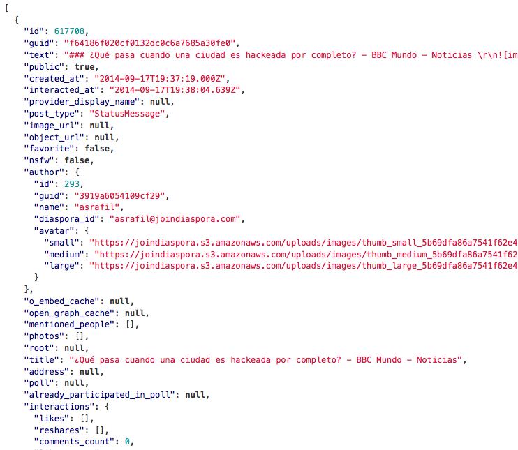

# Diaspora*
## A privacy aware, distributed, open source social network

%%%

### La dispersion d'une communauté ethnique
### ou d'un peuple à travers le monde

%%%

## La petite histoire

- Projet étudiant
- Kickstarter: $10 000, lève > $200 000 (merci Mark Zuckerberg).
- 'Contrer Facebook'
- Réseau complètement décentralisé
- S'installer une instance ou se connecter à l'instance de son choix i.e. 'on place ses données où on le souhaite!'

%%%

%%%

## Notions

- Streams: Streams FTW!!!
- Pods: Instances sur des domaines différents, peuvent se 'parler'. La découverte d'utilisateurs sur d'autres pods est implémentée avec le protocole [Webfinger](code.google.com/p/webfinger/wiki/WebFingerProtocol).
- Aspects: Groupes personnels

%%%

### Diaspora servers communicate with one another in a variety of situations

- When discovering information about users on another server.
- When sending information to people that you’re sharing with. That information includes:
  - Notification that you’ve begun sharing with them.
  - Posts that you’ve made.
  - Comments that have been made (by you or others) on one of your posts.
  - “Like”s that have been made (by you or others) on one of your posts.
  - Conversations (each thread in the inbox has an object representing it)
  - Messages (each individual message in a Conversation)
  - Profile information
  - Retractions of posts
  - Retractions of likes/comments

%%% 

## Streams

- Utilisation des ActivityStreams pour les posts publics: http://activitystrea.ms.
- L'adresse du stream est publié dans la hcard de l'utilisateur.
- Utilisé avec un serveur PubSubHubbub: http://code.google.com/p/pubsubhubbub/

%%%

# API
### (Ou comment utiliser devtools...)

%%%

## Flux

%%%

## Messages

%%%

## Commentaires

%%%

## Technos

- RoR
- Redis
- Backbone

%%%

## Liens

- https://diasporafoundation.org/
- https://github.com/diaspora/diaspora