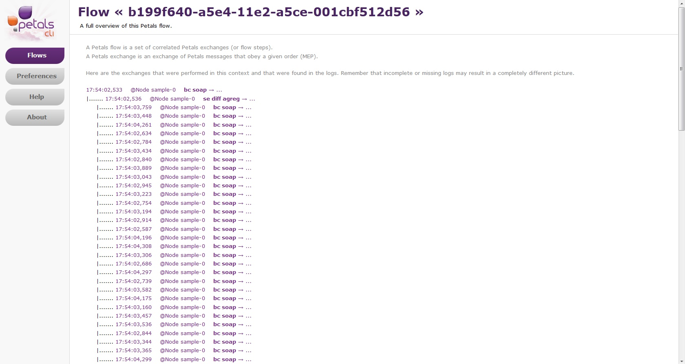
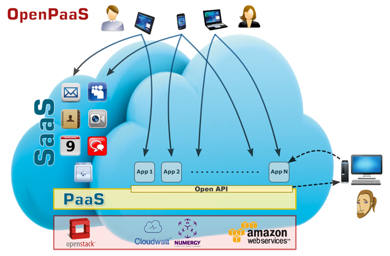

# Integration Platform as a Service...

## Goals

* Integrate heterogeneous services in the Cloud
* On promise services
* Public services
* Orchestrate services
* Create collaborations
* Monitor, manage, ...
* 'Hide' the integration complexity

## Based on...

Petals Enterprise Service Bus

* SOA
* Bind your services
* Orchestration
* Monitor
* Manage
* ...

## and on many other things!

* Storage
* NoSQL
* Tools, tools, tools!!!

## Simple to use

Curl is enough!

    curl -X POST --data "wsdl=http://weather.com/service.wsdl"\ 
      http://ipaas.petalslink.org/services 

.

    {
      'status'  : 'Created',
      'service' : {
        'id' : '92993JMZ399-9837',
        'endpoint' : 'WeatherEndpoint',
        'interface' : 'WeatherPort',
        'service' : 'WeatherService'
      },
      'url' : 'http://ipaas.petalslink.org/WeatherService',
      'wsdl' : 'http://ipaas.petalslink.org/WeatherService?wsdl',
      ...
    }

## Monitor Flows

## Manage

Web app sample

# Usage

# Let's build an Open and Social PaaS!

# Open-PaaS

### [http://open-paas.org](http://open-paas.org)

## Blah blah blah...

> The Open PaaS project aims at developing a PaaS (Platform as a Service) technology dedicated to enterprise collaborative applications deployed on hybrid clouds (private / public). OpenPaaS is a platform that allow to design and deploy applications based on proven technologies provided by partners such as collaborative messaging system, integration and workflow technologies that will be extended in order to address Cloud Computing requirements.

## Architecture

...

## 'Cool stuff inside' tm

- MongoDB
- Cassandra
- nodejs
- OBM
- LemonLDAP
- ...

## Muti-IaaS

* Deployment
* Management
* Broker (Hi petals!)
* ...

# What's Next???

## What's next? \#1

> Code to be published on Petals @ OW2 for the iPaaS - Q1 2014

## What's next?? \#2

> Open PaaS @ OW2? To be discussed...

## What's next??? \#3

> New project for Multi IaaS deployment @ OW2 - Q1 2014

