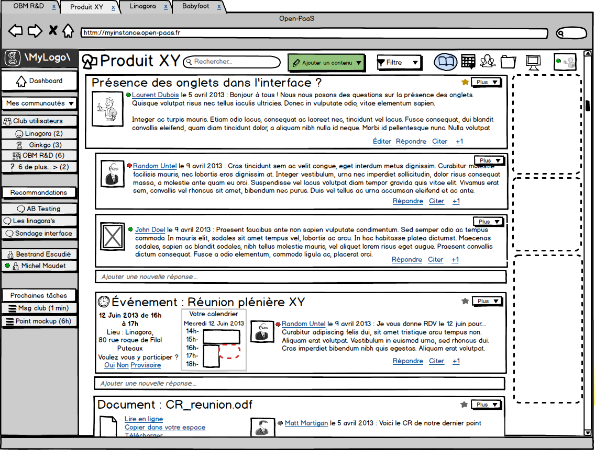

# Part I

# Petals Platform as a Service

## Goals

* Integrate heterogeneous services in the Cloud
* Corporate and private services
* Public services
* Orchestrate services
* Create collaborations!
* Monitor, manage, ...
* 'Hide' the integration complexity

## Based on...

OW2 Petals Enterprise Service Bus

* SOA
* Integrate heterogeneous services
* Orchestration
* Governance
* Monitor
* Manage
* ...

## and on many other things!

* Storage
* NoSQL
* Tools, tools, tools!!!

## Use case \#1
### Bind a Web service

## Using Petals

1. Deploy and start the SOAP Component
2. Create a XML descriptor with required properties
3. Create an archive with the XML descriptor and dependencies...
4. Deploy the archive with JMX
5. Wait...
6. Done!

## Requirements

1. Read the Petals Documentation
2. Install the right components
3. Create the right XML file with the right schema (ok we also have tools for that)
4. Use a JMX client or a Petals compliant library
5. **TIME!**

## Using the Petals PaaS API

#### Input

    curl -X POST --data "wsdl=http://weather.com/service.wsdl"\ 
      http://ipaas.petalslink.org/services 

#### Output

    {
      'status'  : 'Created',
      'service' : {
        'id' : '92993JMZ399-9837',
        'endpoint' : 'WeatherEndpoint',
        'interface' : 'WeatherPort',
        'service' : 'WeatherService'
      },
      'url' : 'http://ipaas.petalslink.org/WeatherService',
      'wsdl' : 'http://ipaas.petalslink.org/WeatherService?wsdl',
      'created_at' : '2013-09-10 2:09:54PMT',
      'version' : '1.0',
      ...
    }

## Requirements

1. curl    

## Use Case \#2
## Deploy a Web service...

## The old way

>  You will need a Java EE server, or a Node runtime, or an Apache+PHP+ xxx...

## The old way

0. Be sure you can install something new...
1. Download the right version
2. Install, configure, etc...
3. Upload your WAR, web app, anything...
4. And then configure Petals &amp; co...
5. ...
6. ...
7. Coffee?
8. ...
9. Done!

## TIME! (and chance...)

## The iPaaS way!

    curl -X POST -data='amwesomeservice.war' http://ipaas.petalslink.org/services

.

    {
      'status'  : 'Created',
      'service' : {
        'id' : '92993JMZ310-9837',
        'endpoint' : 'AwesomeEndpoint',
        'interface' : 'AwesomePort',
        'service' : 'AwesomeService'
      },
      'url' : 'http://ipaas.petalslink.org/AwesomeService',
      'wsdl' : 'http://ipaas.petalslink.org/AwesomeService?wsdl',
      'created_at' : '2013-09-11 2:10:54PMT',
      'version' : '1.0',
      'source' : 'awesome.war',
      ...
    }

### Behind the scene...

1. Detect incoming archive type 
2. If needed, deploy the right server on the right place VM@IaaS
3. Add some hooks
4. Configure Petals to support deployed service
5. Deploy archive
6. Bind the service to petals (all the configuration stuff)
7. Add Petals nodes at the right place if needed...

## Tools

### Multi IaaS Engine

Used to deploy and dynamically configure (distributed) runtimes on multiple IaaS...

#### Use case

* My Petals platform is running on EC2
* It runs tens of Petals nodes
* What if I want to add a new Petals node to my architecture
* Running on my brand new OpenStack platform?

#### Multi IaaS engine is able to

* Deploy new node on OpenStack
* Reconfigure all other nodes running on EC2
* In an automatic way!

## Petals v5 Features!

# Part II

# Let's build an Open and Social PaaS!

# Open-PaaS

### [http://open-paas.org](http://open-paas.org)

## Blah blah blah...

> The Open PaaS project aims at developing a PaaS (Platform as a Service) technology dedicated to enterprise collaborative applications deployed on hybrid clouds (private / public). OpenPaaS is a platform that allow to design and deploy applications based on proven technologies provided by partners such as collaborative messaging system, integration and workflow technologies that will be extended in order to address Cloud Computing requirements.

# We build the next generation of Open Source Software for entreprise communication in the Cloud

# API(s)!!!

### User-level

* Agenda, Contact, Feed, Chat, Phone, Feed, Search...

* Create mashups, orchestrate, integrate, add your own APIs...

### Technical-level

* Deploy and manage runtimes, IaaS, ...
* **Hello Multi IaaS!!!**

## 'Cool stuff inside' tm

- Petals PaaS
- MongoDB
- Cassandra
- nodejs
- OBM
- LemonLDAP
- OpenStack
- ...

# What's Next???

## What's next? \#1

> Petals PaaS to be published on Petals @ OW2

> Q1 2014

## What's next??? \#2

> New project for Multi IaaS deployment and management @ OW2

> Q1 2014

## What's next?? \#3

> Open PaaS @ OW2?

> To be discussed...

