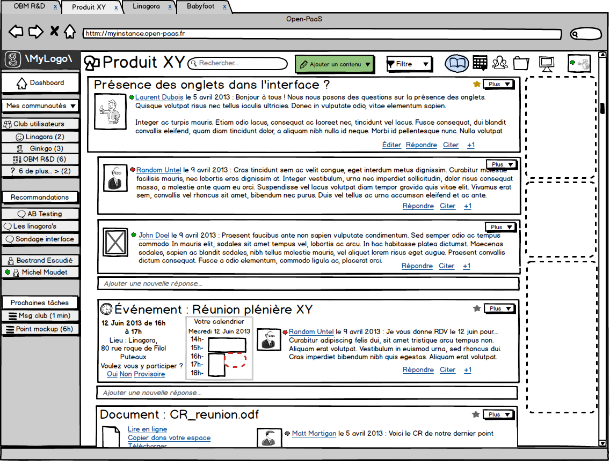

# XMPP

eXensible Message and Presence Protocol


* Ensemble de protocoles ouverts (IETF) pour la messagerie instantanée
* Architecture décentralisée d'échanges de données
* Système de collaboration 'temps réel' et d'échange multimédia (VoIP, visio, échange de données)
* Born in 1998


## Liens avec le RSE

- Implémenter (au moins) le chat et la présence





## 'Architecture'

- Echange de messages XML sur TCP/IP
- Architecture client-serveur et serveur-serveur
- 'Maillage' de serveurs public/privé


## Protocole

- 2 parties:
  - Le protocole de base, définit dans diverses RFCs, rien ne peut marcher sans leur implémentation
  - Les extensions (XEP - XMPP Extension Protocols), proposition d'ajouts aux protocoles de base. TODO Ref requise.


## Populaire!

- Chat: Utilisé par des millions de personnes (Google, Facebook, Apple, Skype, MSN, ...)
- Supervision, data transfert (ETL, EAI, ESB), whiteboard, jeux, ...


## Fonctionnement

       ------          ------------                    --------------        ---------
      | Yolo |  <-->  | hiveety.io |  <- Internet ->  | facebook.com | <--> | Awesome |
       ------          ------------                    --------------        ---------
     Utilisateur         Serveur                          Serveur           Utilisateur


## Adresse Utilisateur

**yolo@hiveety.io/web**

- Nom d'utilisateur (unique sur le serveur)
- Serveur
- Ressource (optionelle et non fixe)


## Présence et état

- Lors de la connexion d'un utilisateur au serveur, le serveur va notifier de la présence de l'utilisateur à l'ensemble de ses contacts (liste des contacts stockée sur le serveur).
- L'utilisateur peur spécifier son état ('en ligne', 'absent', 'déconnecté', ...)


## Groupes

cf rse@conference.linagora.com


## Et plus...

- Transport (passerelles entre systèmes de messages, par exemple IRC <-> Jabber)
- Priorité des messages via les ressources
- Transfert de fichiers entre utilisateurs
-  ...


## Utilisation dans l'ESN

- Fournir un système de chat aux utilisateurs (one to one, groupe, domaine, ...) et être capable de d'afficher la présence/l'état des utilisateurs 
- Pouvoir utiliser ses fonctionnalités depuis l'application Web mais pas que...
- Pouvoir stocker les messages échangés, créer des flux de messages avancés (activitystream)


### Un exemple d'integration

     Utilisateur Web          Serveur Web            Serveur Jabber              Utilisateur
         ------              ------------              ----------             -------------------
        | Yolo |  <- WS ->  | hiveety.io |  <- TCP -> | ejabberd | <- TCP -> | Client Lourd XMPP | 
         ------              ------------              ----------             -------------------


## Oui mais...

- Comment stocker les messages et les états de l'utilisateur qui se connecte en utilisant un client XMPP standard?
- Créer un client sur le serveur par client connecté au RSE
- Facile pour stocker les interactions client/serveur


### Déporter le client sur le browser

    Utilisateur Web      Serveur Web        Serveur Jabber                      Utilisateur
         ------              ------------              ----------             -------------------
        | Yolo |  <- WS ->  | hiveety.io |  <- TCP -> | ejabberd | <- TCP -> | Client Lourd XMPP | 
         ------              ------------              ----------             -------------------
                  \_______ node-xmpp.js __________/


## Let's Hack!

- node-xmpp-server: Serveur XMPP en node
- node-xmpp: Client xmpp (node et browser)
- Ignite Realtime (smack): Java, système d'extensions
- ejabberd: ...


## node-xmpp

```
var client = new xmpp.Client({
    jid: 'user@example.com',
    password: 'password'
});

client.on('connection', function() {
    console.log('online')
});

client.on('stanza', function(stanza) {
    console.log('Incoming stanza: ', stanza.toString())
});
```

```
client.end();
```


# Discussions